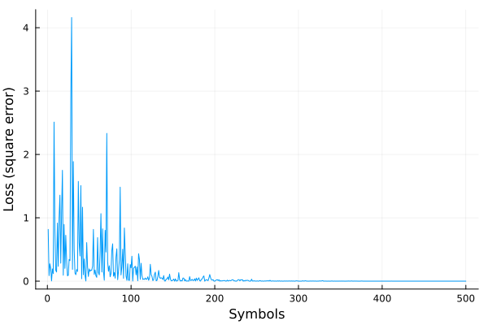

[](https://github.com/org-arl/UnderwaterAcoustics.jl/actions)

# AdaptiveEstimators.jl
### Adaptive estimation and filtering tools

## Features

- Framework supporting various system models and learning algorithms
- Linear system model for channel estimation, linear equalization, etc.
- Decision-feedback equalizer (DFE) model
- Various learning algorithms including:
  - least mean square (LMS)
  - normalized least mean square (NLMS)
  - recursive least square (RLS)

## Installation

```julia
julia> ] # to enter package mode
pkg> add AdaptiveEstimators
```

## API

Currently, the public API consists of only the following:
```
# fit model to data (x, y) using specified algorithm
fit!(model::SystemModel, alg::Estimator, x, y; saveat, rng)
fit!(model::SystemModel, alg::Estimator, x, y, nsteps, decision; ...)

# available models
LinearModel(ptype, n)
DFE(ffsize, fbsize)
DFE(T, ffsize, fbsize)

# available estimation algorithms
LMS(μ=0.01)
NLMS(μ=0.1)
RLS(λ=0.99, σ=1.0)

# utilities
nearest(constellation)
```
See docstrings (`help fit!`, etc) for details.

## Examples

### Channel estimation
Consider a linear system:
$$
y_n = \sum_{i=0}^{N-1} h_i^* x_{n-i} + \text{noise}.
$$
Here, $\{x_n\}$ may be a transmitted communication signal, and $\{y_n\}$ the received signal after passing through a channel with an impulse response $\{h_i\}$. Let us first consider a channel estimation application where we transmit a known baseband complex signal $\{x_n\}$, observe the received baseband complex signal $\{y_n\}$, and wish to estimate $\{h_i\}$:
```julia
using AdaptiveEstimators

# generate a random signal
x = randn(ComplexF64, 1024)

# pass it through an example 3-tap channel and add some noise
y = 0.8 * copy(x) +
    0.3im * vcat(zeros(7), x[1:end-7]) +
    (-0.2-0.5im) * vcat(zeros(11), x[1:end-11]) +
    1e-2 * randn(ComplexF64, length(x))

# estimate the channel adaptively using a linear model
r = fit!(LinearModel(ComplexF64, 16), LMS(), x, y)

# show the channel estimate to 2 decimal places
round.(r.p; digits=2)
```
which results in something like:
```julia
16-element Vector{ComplexF64}:
  0.8f0 - 0.0f0im
 -0.0f0 - 0.0f0im
  0.0f0 - 0.0f0im
 -0.0f0 + 0.0f0im
 -0.0f0 + 0.0f0im
  0.0f0 - 0.0f0im
  0.0f0 + 0.0f0im
 -0.0f0 - 0.3f0im
  0.0f0 - 0.0f0im
  0.0f0 - 0.0f0im
  0.0f0 - 0.0f0im
 -0.2f0 + 0.5f0im
 -0.0f0 + 0.0f0im
 -0.0f0 - 0.0f0im
  0.0f0 + 0.0f0im
 -0.0f0 - 0.0f0im
```
which is consistent with our 3-tap channel. You could have used NLMS or RLS by simply replacing the `LMS()` with `NLMS()` or `RLS()`. We can see that the channel estimate converges in about 250 symbols or less:
```
using Plots
plot(r.loss[1:500]; legend=false, xlabel="Symbols", ylabel="Loss (square error)")
```


### Channel equalization

Let's next consider the same channel, but we transmit a QPSK modulation signal through it:
```julia
# QPSK constellation
Q = [1.0, 1.0im, -1.0, -1.0im]

# generate random data to transmit
x = rand(Q, 8192)

# transmit through the 3-tap channel with noise
y = 0.8 * copy(x) +
    0.3im * vcat(zeros(7), x[1:end-7]) +
    (-0.2-0.5im) * vcat(zeros(11), x[1:end-11]) +
    1e-2 * randn(ComplexF64, length(x))

# equalize using a 64-tap linear equalizer, RLS training and 512 training symbols
r = fit!(LinearModel(ComplexF64, 64), RLS(), y, x[1:512], length(x), nearest(Q))
```
The first 512 training symbols are used to estimate the equalizer initially. After that the `nearest(Q)` decision function is used to continue adapting the equalizer in a decision-directed mode. We can check the symbol error rate (SER) and the equalized constellation:
```julia
# decisions are made by choosing the nearest constellation point
decision =  nearest(Q)

# compute SER by excluding the first 512 training symbols
ser = count(decision.(r.y[513:end]) .!= x[513:end]) / (8192 - 512)

# plot the constellation
scatter(r.y[513:end]; markersize=2, legend=false, title="SER=$(round(ser; digits=6))")
```


Let's try the same using a 16-tap DFE:
```julia
r = fit!(DFE(16), RLS(), y, x[1:512], length(x), nearest(Q))
ser = count(decision.(r.y[513:end]) .!= x[513:end]) / (8192 - 512)
scatter(r.y[513:end]; markersize=2, legend=false, title="SER=$(round(ser; digits=6))")
```


Perfect equalization!

## Contributing

Contributions in the form of bug reports, feature requests, ideas/suggestions, bug fixes, code enhancements, and documentation updates are most welcome. To understand the design of the package, a good starting point is the documentation of the model and estimation algorithm API in [`types.jl`](src/types.jl).
